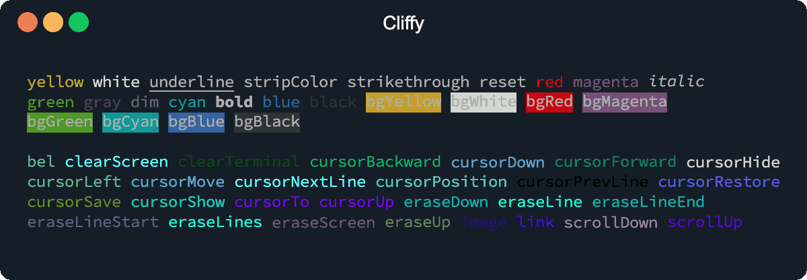

# Ansi

Chainable ansi escape sequences.



## Usage

### Ansi escape sequences

The [ansi](./ansi.md) and [tty](./tty.md) module can be used to generate or
write ansi escape sequences to stdout.

```typescript
import { tty } from "https://deno.land/x/cliffy/ansi/tty.ts";

tty.cursorSave
  .cursorHide
  .cursorTo(0, 0)
  .eraseScreen();
```

### Colors

The [colors](./colors.md) module is a simple and tiny chainable wrapper for
[deno's std colors](https://deno.land/std/fmt/colors.ts) module and works
similar to node's [chalk](https://github.com/chalk/chalk) module.

```typescript
import { colors } from "https://deno.land/x/cliffy/ansi/colors.ts";

console.log(
  colors.bold.underline.rgb24("Welcome to Deno.Land!", 0xff3333),
);
```
