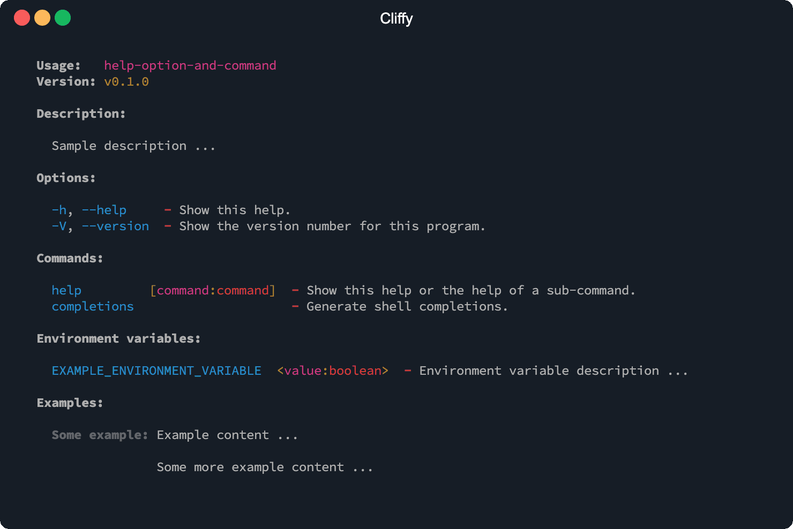
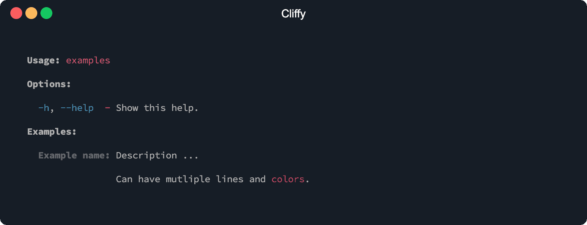

# Auto generated help

The help information is auto-generated based on the information you have defined
on your commands. The name, version, description, meta informations, options,
commands, environment variables and examples are displayed in the help.

To display the help you can invoke the [help option](#help-option) (`-h` or
`--help`) or the [help command](./build_in_commands.md#help-command) (`help`) on
the main or on one of the sub commands. The `help` command needs to be
registered manually.

To retrieve the help text programmatically you can use the
[.showHelp()](#print-help) and [.getHelp()](#get-help) methods.

```typescript
import { Command } from "https://deno.land/x/cliffy/command/command.ts";

await new Command()
  .name("help-option-and-command")
  .version("0.1.0")
  .description("Sample description ...")
  .env(
    "EXAMPLE_ENVIRONMENT_VARIABLE=<value:boolean>",
    "Environment variable description ...",
  )
  .example(
    "Some example",
    "Example content ...\n\nSome more example content ...",
  )
  .parse(Deno.args);
```

```console
$ deno run https://deno.land/x/cliffy/examples/command/help.ts --help
```



## Print help

You can use the `.showHelp()` method to output the help to stdout.

## Get help

The `.getHelp()` method returns the auto generated help as string.

## Additional info

You can add some additional information to the help text with the
`.meta(name, value)` method.

```ts
new Command()
  .name("example")
  .version("1.0.0")
  .description("Example command.")
  .meta("deno", Deno.version.deno)
  .meta("v8", Deno.version.v8)
  .meta("typescript", Deno.version.typescript)
  .parse();
```

The additional information is displayed below the command version in the auto
generated help.

```console
  Usage:   example
  Version: 0.1.0

  deno: 1.16.1
  v8: 9.7.106.2
  typescript: 4.4.2

  Description:

    Example command.
```

## Customize help

The `.help()` method can be used to disable or enable `types`, `hints` and
`colors` for the auto generated help.

```typescript
import { Command } from "https://deno.land/x/cliffy/command/command.ts";

await new Command()
  .help({
    // Show argument types.
    types: true, // default: false
    // Show hints.
    hints: true, // default: true
    // Enable/disable colors.
    colors: false, // default: true
  })
  .option("-f, --foo [val:number]", "Some description.", {
    required: true,
    default: 2,
  })
  .parse();
```

## Override help

The `.help()` method can be also used to override the help output. This
overrides the output of the `.getHelp()` and `.showHelp()` methods which are
used by the help option and help command. The help handler will be also used for
all sub command, but can be overridden in each sub command separately.

```typescript
import { Command } from "https://deno.land/x/cliffy/command/command.ts";

await new Command()
  .help("My custom help")
  // Can be also a function.
  .help(() => "My custom help")
  .parse();
```

## Help option

The `-h` and `--help` option flag prints the auto generated help to stdout.

The short flag `-h` prints only the first line of each option and command
description. With the long flag (`--help`) the full description is printed for
each option and command.

Optionally you can also register the pre-defined
[help](./build_in_commands.md#help-command) command to display the help.

### Customize help option

The help option is completely customizable with the `.helpOption()` method. It
has the same arguments as the normal `.option()` method. With the first argument
you specify the flags followed by the description. The third argument can be an
action handler or an options object. The second and third arguments are
optional.

```typescript
await new Command()
  .helpOption("-i, --info", "Print help info.", function (this: Command) {
    console.log("some help info ...", this.getHelp());
  })
  .parse(Deno.args);
```

You can also override the default options of the help option. The options are
the same as for the `.option()` method.

```typescript
await new Command()
  .helpOption(" -x, --xhelp", "Print help info.", { global: true })
  .parse(Deno.args);
```

To disable the help option you can pass false to the `.helpOption()` method.

```typescript
await new Command()
  .helpOption(false)
  .parse(Deno.args);
```

## Version option

The `--version` and `-V` option flag prints the version number defined with the
`version()` method. The version number will be also display in the auto
generated help. If the long `--version` option is used, the long format will be
printed including command name and all meta data defined with the
[.meta()](#additional-info) method.

```typescript
import { Command } from "https://deno.land/x/cliffy/command/mod.ts";

await new Command()
  .version("0.1.0")
  .parse(Deno.args);
```

```console
$ deno run https://deno.land/x/cliffy/examples/command/version_options.ts -V
$ deno run https://deno.land/x/cliffy/examples/command/version_options.ts --version
0.0.1
```

### Customize version option

The version option is completely customizable with the `.versionOption()`
method. It has the same arguments as the normal `.option()` method. With the
first argument you specify the flags followed by the description. The third
argument can be an action handler or an options object. The second and third
arguments are optional.

```typescript
await new Command()
  .version("0.1.0")
  .versionOption(
    " -x, --xversion",
    "Print version info.",
    function (this: Command) {
      console.log("Version: %s", this.getVersion());
    },
  )
  .parse(Deno.args);
```

You can also override the default options of the version option. The options are
the same as for the `.option()` method.

```typescript
await new Command()
  .version("0.1.0")
  .versionOption(" -x, --xversion", "Print version info.", { global: true })
  .parse(Deno.args);
```

The version option can be also disabled.

```typescript
await new Command()
  .versionOption(false)
  .parse(Deno.args);
```

## Add examples

You can add some examples for your command which will be displayed in the auto
generated help.

```typescript
import { red } from "https://deno.land/std/fmt/colors.ts";
import { Command } from "https://deno.land/x/cliffy/command/mod.ts";

await new Command()
  .name("examples")
  .example(
    "example name",
    `Description ...\n\nCan have multiple lines and ${red("colors")}.`,
  )
  .parse(Deno.args);
```

```console
$ deno run https://deno.land/x/cliffy/examples/command/examples.ts help
```


