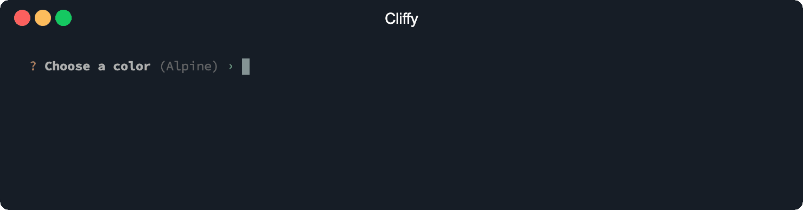
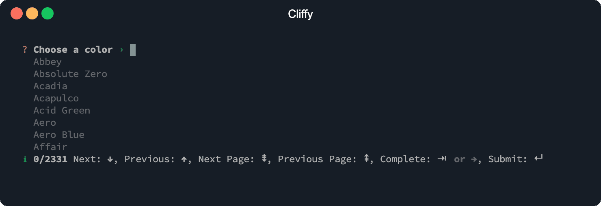

# Auto suggestions

You can provide suggestions to the [input](./types/input.md),
[number](./types/number.md) and [list](./types/list.md) prompt to enable
tab-completions with the [suggestions](#suggestions) and/or
[id](#local-storage-id) option. If an `id` is provided, the values will be saved
to the local storage using the `id` as local storage key. With `suggestions` you
can provide some default suggestions. Both options can be defined at the same
time.

```shell
deno install you/cli.ts --location https://example.com
# or
deno run you/cli.ts --location https://example.com
```

## Options

### Suggestions

The `suggestions` option specifies a list of default suggestions.

```typescript
import { Input } from "@cliffy/prompt/input";

const color = await Input.prompt({
  message: "Choose a color",
  suggestions: [
    "Abbey",
    "Absolute Zero",
    "Acadia",
    "Acapulco",
    "Acid Green",
    "Aero",
    "Aero Blue",
    "Affair",
    "African Violet",
    "Air Force Blue",
  ],
});

console.log({ color });
```

```console
$ deno run examples/prompt/suggestions.ts
```



### Local storage id

If the `id` option is provided, values are stored in the local storage using the
id as local storage key. The stored values are used as suggestions the next time
the prompt is used.

> [!NOTE]
> The `id` option requires deno >= `1.10` and the `--location` flag. Since deno
> `1.16.0` the `--location` flag is optional.

### Path completions

To enable path completions for relative and absolute files, set the `files`
option to `true`. Path completions is only available for `Input` and `List`
prompts.

### Suggestions list

With the `list` option you can display a list of suggestions. Matched
suggestions are highlighted in the list. Press `tab` to complete the highlighted
suggestion, or `enter` to accept and submit it (see
[Complete on submit](#complete-on-submit)).

You can also display the info bar with the `info` option to show the number of
available suggestions and usage information.

```typescript
import { Input } from "@cliffy/prompt/input";

const color = await Input.prompt({
  message: "Choose a color",
  list: true,
  info: true,
  suggestions: [
    "Abbey",
    "Absolute Zero",
    "Acadia",
    "Acapulco",
    "Acid Green",
    "Aero",
    "Aero Blue",
    "Affair",
    "African Violet",
    "Air Force Blue",
  ],
});

console.log({ color });
```

```console
$ deno run examples/prompt/suggestions_list.ts
```



#### Max suggestions

With the `maxRows` option you specify the number of suggestions displayed per
page. Defaults to `10`.

### Search mode

The `searchMode` option controls the matching strategy used to filter, rank and
highlight suggestions. Defaults to `"all"`.

- `"substring"`: classic contiguous substring match.
- `"fuzzy"`: match the typed characters in order, allowing gaps (e.g. `strubu`
  matches `structure-builder`).
- `"typo"`: tolerate misspellings via edit distance (e.g. `stroberry` matches
  `strawberry`), without fuzzy subsequence matching.
- `"all"`: combines `"substring"`, `"fuzzy"` and `"typo"`.

Substring matches always rank above fuzzy matches, which always rank above
typo-tolerant matches, regardless of their inner scores.

```ts ignore
import { Input } from "@cliffy/prompt/input";

const color = await Input.prompt({
  message: "Choose a color",
  list: true,
  searchMode: "substring",
  suggestions: ["Abbey", "Acadia", "Aero"],
});

console.log({ color });
```

### Complete on submit

The `completeOnSubmit` option controls whether the highlighted suggestion is
accepted when the prompt is submitted. When enabled and a suggestion is
highlighted, pressing `enter` completes the highlighted suggestion and submits
it instead of the raw input value. If no suggestion matches the current input,
the typed value is submitted. A custom `complete` handler and
[path completions](#path-completions) are respected.

The default depends on the `list` option:

- With `list: true`, suggestions are shown as a highlighted list and
  `completeOnSubmit` defaults to `true`, so `enter` accepts the highlighted
  entry (menu-like behavior).
- For inline suggestions (`list` disabled), it defaults to `false`, so `enter`
  submits the typed value, like fish/zsh autosuggestions.

Set the option explicitly to override the per-mode default:

```ts ignore
import { Input } from "@cliffy/prompt/input";

const color = await Input.prompt({
  message: "Choose a color",
  list: true,
  suggestions: ["Abbey", "Acadia", "Aero"],
  completeOnSubmit: false,
});

console.log({ color });
```

To submit a value that is a prefix of a suggestion (for example `Ab` while
`Abbey` is highlighted), press `escape` to dismiss the highlighted suggestion,
then `enter` to submit the typed value. Typing or navigating the list
re-activates suggestions. The dismiss key can be changed with the `deselect`
keymap (`keys: { deselect: ["escape"] }`).
