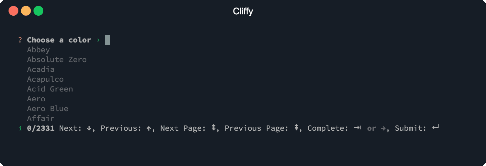
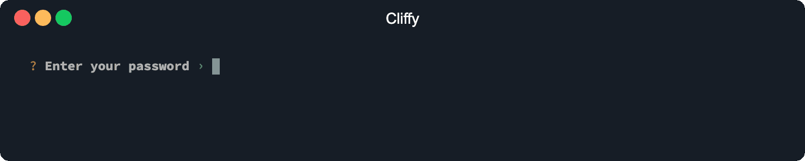
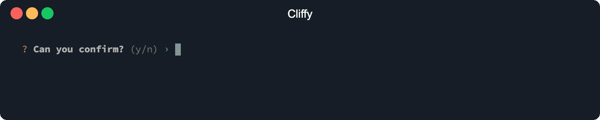
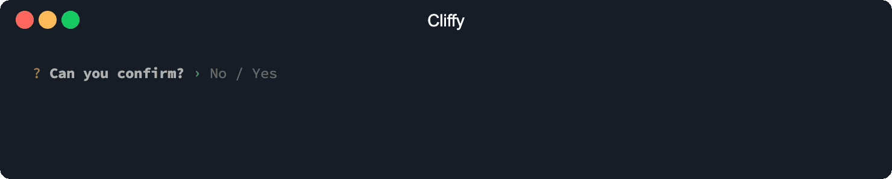
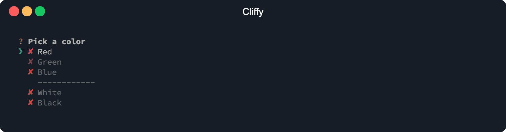

# Types

## Input

The input prompt is a simple text input and has support all
[basic options](./base_options.md) and
[auto suggestions](#input-auto-suggestions).

```typescript
import { Input } from "https://deno.land/x/cliffy/prompt/input.ts";

const name: string = await Input.prompt("What's your github user name?");
```

```console
$ deno run --unstable https://deno.land/x/cliffy/examples/prompt/input.ts
```


**Options**

The `Input` prompt has all [base](#base-options) and the following prompt
specific options.

| Param       |           Type            | Required | Description                                                                                                                                                                    |
| ----------- | :-----------------------: | :------: | ------------------------------------------------------------------------------------------------------------------------------------------------------------------------------ |
| minLength   |         `number`          |    No    | Min length of value. Defaults to `0`.                                                                                                                                          |
| maxLength   |         `number`          |    No    | Max length of value. Defaults to `infinity`.                                                                                                                                   |
| suggestions | `Array<string \| number>` |    No    | A list of auto suggestions.                                                                                                                                                    |
| id          |         `string`          |    No    | If an id is provided, values are stored in the local storage using the id as local storage key. The stored values are used as suggestions at the next time the prompt is used. |
| list        |         `number`          |    No    | Show auto suggestions list.                                                                                                                                                    |
| maxRows     |         `number`          |    No    | Number of options suggestions per page. Defaults to `10`.                                                                                                                      |
| listPointer |         `string`          |    No    | Change the list pointer icon.                                                                                                                                                  |
| info        |         `number`          |    No    | Show some usage information.                                                                                                                                                   |

### Input auto suggestions

You can provide suggestions to the `Input`, `Number` and `List` prompt to enable
tab-completions with the `suggestions` and/or `id` option. If an `id` is
provided, the values will be saved to the local storage using the `id` as local
storage key. Both options can be defined at the same time.

The `id` option requires deno >= `1.10` and the `--location` flag.

```shell
deno install you/cli.ts --location https://example.com
# or
deno run you/cli.ts --location https://example.com
```


```typescript
import { Input } from "https://deno.land/x/cliffy/prompt/input.ts";

const color: string = await Input.prompt({
  message: "Choose a color",
  id: "<local-storage-key>",
  suggestions: [
    "Abbey",
    "Absolute Zero",
    "Acadia",
    "Acapulco",
    "Acid Green",
    "Aero",
    "Aero Blue",
    "Affair",
    "African Violet",
    "Air Force Blue",
  ],
});

console.log({ color });
```

```console
$ deno run --unstable https://deno.land/x/cliffy/examples/prompt/suggestions.ts
```

Suggestions can be also shown as a list. Matched suggestions will be highlighted
in the list and can be completed with the `tab` key.

You can also enable the info bar to show the number of available suggestions and
usage information.



```typescript
import { Input } from "https://deno.land/x/cliffy/prompt/input.ts";

const color: string = await Input.prompt({
  message: "Choose a color",
  list: true,
  info: true,
  suggestions: [
    "Abbey",
    "Absolute Zero",
    "Acadia",
    "Acapulco",
    "Acid Green",
    "Aero",
    "Aero Blue",
    "Affair",
    "African Violet",
    "Air Force Blue",
  ],
});

console.log({ color });
```

```console
$ deno run --unstable https://deno.land/x/cliffy/examples/prompt/suggestions_list.ts
```

## Number

**Example**


```typescript
import { Number } from "https://deno.land/x/cliffy/prompt/number.ts";

const age: number = await Number.prompt("How old are you?");
```

```console
$ deno run --unstable https://deno.land/x/cliffy/examples/prompt/number.ts
```

**Options**

The `Number` prompt has all [base options](#base-options) and the following
prompt specific options.

| Param       |           Type            | Required | Description                                                                                                                                                                    |
| ----------- | :-----------------------: | :------: | ------------------------------------------------------------------------------------------------------------------------------------------------------------------------------ |
| min         |         `number`          |    No    | Min value. Defaults to `-infinity`.                                                                                                                                            |
| max         |         `number`          |    No    | Max value. Defaults to `Infinity`.                                                                                                                                             |
| float       |         `boolean`         |    No    | Allow floating point inputs. Defaults to `false`.                                                                                                                              |
| round       |         `number`          |    No    | Round float values to `x` decimals. Defaults to `2`.                                                                                                                           |
| suggestions | `Array<string \| number>` |    No    | A list of auto suggestions.                                                                                                                                                    |
| id          |         `string`          |    No    | If an id is provided, values are stored in the local storage using the id as local storage key. The stored values are used as suggestions at the next time the prompt is used. |
| list        |         `number`          |    No    | Show auto suggestions list.                                                                                                                                                    |
| maxRows     |         `number`          |    No    | Number of options suggestions per page. Defaults to `10`.                                                                                                                      |
| listPointer |         `string`          |    No    | Change the list pointer icon.                                                                                                                                                  |
| info        |         `number`          |    No    | Show some usage information.                                                                                                                                                   |

## Secret

**Example**



```typescript
import { Secret } from "https://deno.land/x/cliffy/prompt/secret.ts";

const password: string = await Secret.prompt("Enter your password");
```

```console
$ deno run --unstable https://deno.land/x/cliffy/examples/prompt/secret.ts
```

**Options**

The `Secret` prompt has all [base options](#base-options) and the following
prompt specific options.

| Param     |   Type   | Required | Description                                                             |
| --------- | :------: | :------: | ----------------------------------------------------------------------- |
| label     | `string` |    No    | Name of secret. Defaults to `Password`.                                 |
| hidden    | `number` |    No    | Hide input during typing and show a fix number of asterisks on success. |
| minLength | `number` |    No    | Min length of secret value. Defaults to `0`.                            |
| maxLength | `number` |    No    | Max length of secret value. Defaults to `infinity`.                     |

## Confirm

**Example**



```typescript
import { Confirm } from "https://deno.land/x/cliffy/prompt/confirm.ts";

const confirmed: boolean = await Confirm.prompt("Can you confirm?");
```

```console
$ deno run --unstable https://deno.land/x/cliffy/examples/prompt/confirm.ts
```

**Options**

The `Config` prompt has all [base options](#base-options) and the following
prompt specific options.

| Param    |   Type   | Required | Description                                    |
| -------- | :------: | :------: | ---------------------------------------------- |
| active   | `string` |    No    | Text for `active` state. Defaults to `'Yes'`.  |
| inactive | `string` |    No    | Text for `inactive` state. Defaults to `'No'`. |

## Toggle

**Example**



```typescript
import { Toggle } from "https://deno.land/x/cliffy/prompt/toggle.ts";

const confirmed: boolean = await Toggle.prompt("Can you confirm?");
```

```console
$ deno run --unstable https://deno.land/x/cliffy/examples/prompt/toggle.ts
```

**Options**

The `Toggle` prompt has all [base options](#base-options) and the following
prompt specific options.

| Param    |   Type   | Required | Description                                    |
| -------- | :------: | :------: | ---------------------------------------------- |
| active   | `string` |    No    | Text for `active` state. Defaults to `'Yes'`.  |
| inactive | `string` |    No    | Text for `inactive` state. Defaults to `'No'`. |

## List

**Example**


```typescript
import { List } from "https://deno.land/x/cliffy/prompt/list.ts";

const keywords: string[] = await List.prompt("Enter some keywords");
```

```console
$ deno run --unstable https://deno.land/x/cliffy/examples/prompt/list.ts
```

### List auto suggestions

You can provide suggestions to the `Input`, `Number` and `List` prompt to enable
tab-completions with the `suggestions` and/or `id` option. If an `id` is
provided, the value will be saved to the local storage using the `id` as local
storage key. Both options can be defined at the same time.

The `id` option requires deno >= `1.10` and the `--location` flag.

```shell
deno install you/cli.ts --location https://example.com
# or
deno run you/cli.ts --location https://example.com
```


```typescript
import { List } from "https://deno.land/x/cliffy/prompt/list.ts";

const color: string = await List.prompt({
  message: "Choose a color",
  id: "<local-storage-key>",
  suggestions: [
    "Abbey",
    "Absolute Zero",
    "Acadia",
    "Acapulco",
    "Acid Green",
    "Aero",
    "Aero Blue",
    "Affair",
    "African Violet",
    "Air Force Blue",
  ],
});

console.log({ color });
```

```console
$ deno run --unstable https://deno.land/x/cliffy/examples/prompt/suggestions_list_prompt.ts
```

**Options**

The `List` prompt has all [base options](#base-options) and the following prompt
specific options.

| Param       |           Type            | Required | Description                                                                                                                                                                    |
| ----------- | :-----------------------: | :------: | ------------------------------------------------------------------------------------------------------------------------------------------------------------------------------ |
| separator   |         `string`          |    No    | String separator. Will trim all white-spaces from start and end of string. Defaults to `','`.                                                                                  |
| minLength   |         `number`          |    No    | Min length of a single tag. Defaults to `0`.                                                                                                                                   |
| maxLength   |         `number`          |    No    | Max length of a single tag. Defaults to `infinity`.                                                                                                                            |
| minTags     |         `number`          |    No    | Min number of tags. Defaults to `0`.                                                                                                                                           |
| maxTags     |         `number`          |    No    | Max number of tags. Defaults to `infinity`.                                                                                                                                    |
| suggestions | `Array<string \| number>` |    No    | A list of auto suggestions.                                                                                                                                                    |
| id          |         `string`          |    No    | If an id is provided, values are stored in the local storage using the id as local storage key. The stored values are used as suggestions at the next time the prompt is used. |
| list        |         `number`          |    No    | Show auto suggestions list.                                                                                                                                                    |
| maxRows     |         `number`          |    No    | Number of options suggestions per page. Defaults to `10`.                                                                                                                      |
| listPointer |         `string`          |    No    | Change the list pointer icon.                                                                                                                                                  |
| info        |         `number`          |    No    | Show some usage information.                                                                                                                                                   |

## Select

**Example**


```typescript
import { Select } from "https://deno.land/x/cliffy/prompt/select.ts";

const color: string = await Select.prompt({
  message: "Pick a color",
  options: [
    { name: "Red", value: "#ff0000" },
    { name: "Green", value: "#00ff00", disabled: true },
    { name: "Blue", value: "#0000ff" },
    Select.separator("--------"),
    { name: "White", value: "#ffffff" },
    { name: "Black", value: "#000000" },
  ],
});
```

```console
$ deno run --unstable https://deno.land/x/cliffy/examples/prompt/select.ts
```

**Options**

The `Select` prompt has all [base options](#base-options) and the following
prompt specific options.

| Param       |          Type          | Required | Description                                             |
| ----------- | :--------------------: | :------: | ------------------------------------------------------- |
| options     | `(string \| Option)[]` |   Yes    | Array of strings or Options.                            |
| maxRows     |        `number`        |    No    | Number of options displayed per page. Defaults to `10`. |
| listPointer |        `string`        |    No    | Change the list pointer icon.                           |
| search      |       `boolean`        |    No    | Enable search/filter input.                             |
| searchLabel |        `string`        |    No    | Change the search input label.                          |

**Option**

| Param    |   Type    | Required | Description                                        |
| -------- | :-------: | :------: | -------------------------------------------------- |
| value    | `string`  |   Yes    | Value which will be returned as result.            |
| name     | `string`  |    No    | Name is displayed in the list. Defaults to `value` |
| disabled | `boolean` |    No    | Disabled item. Can't be selected.                  |

## Checkbox

**Example**



```typescript
import { Checkbox } from "https://deno.land/x/cliffy/prompt/checkbox.ts";

const colors: string[] = await Checkbox.prompt({
  message: "Pick a color",
  options: [
    { name: "Red", value: "#ff0000" },
    { name: "Green", value: "#00ff00", disabled: true },
    { name: "Blue", value: "#0000ff" },
    Checkbox.separator("--------"),
    { name: "White", value: "#ffffff" },
    { name: "Black", value: "#000000" },
  ],
});
```

```console
$ deno run --unstable https://deno.land/x/cliffy/examples/prompt/checkbox.ts
```

**Options**

The `Checkbox` prompt has all [base options](#base-options) and the following
prompt specific options.

| Param       |          Type          | Required | Description                                               |
| ----------- | :--------------------: | :------: | --------------------------------------------------------- |
| options     | `(string \| Option)[]` |   Yes    | Array of strings or Options.                              |
| maxRows     |        `number`        |    No    | Number of options displayed per page. Defaults to `10`.   |
| minOptions  |        `number`        |    No    | Min number of selectable options. Defaults to `0`.        |
| maxOptions  |        `number`        |    No    | Max number of selectable options. Defaults to `infinity`. |
| listPointer |        `string`        |    No    | Change the list pointer icon.                             |
| search      |       `boolean`        |    No    | Enable search/filter input.                               |
| searchLabel |        `string`        |    No    | Change the search input label.                            |
| check       |        `string`        |    No    | Change the check icon.                                    |
| uncheck     |        `string`        |    No    | Change the uncheck icon.                                  |

**Option**

| Param    |   Type    | Required | Description                                             |
| -------- | :-------: | :------: | ------------------------------------------------------- |
| value    | `string`  |   Yes    | Value which will be added to the returned result array. |
| name     | `string`  |    No    | Name is displayed in the list. Defaults to `value`.     |
| disabled | `boolean` |    No    | Disabled item. Can't be selected.                       |
| checked  | `boolean` |    No    | Whether item is checked or not. Defaults to `false`.    |
| icon     | `boolean` |    No    | Show or hide item icon. Defaults to `true`.             |
