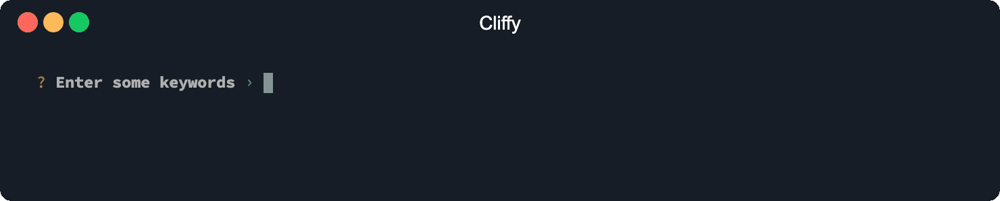
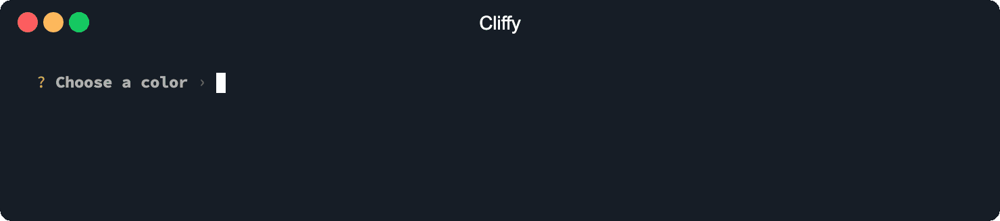

# List

The `List` prompt is a text input that lets you input multiple values with
support for [auto suggestions](#auto-suggestions).



```typescript
import { List } from "https://deno.land/x/cliffy/prompt/list.ts";

const keywords: string[] = await List.prompt("Enter some keywords");
```

```console
$ deno run --unstable https://deno.land/x/cliffy/examples/prompt/list.ts
```

## Options

The `List` prompt implements all [base](./index.md) and
[auto suggestion](../auto_suggestions.md) options and the following prompt
specific options.

### Tag separator

With the `separator` option you specify the delimiter that is used for
separating the tags. Default is `,`.

### Min input length

The `minLength` option specifies the minimum length of a tag. Default is `0`.

### Max input length

The `maxLength` option specifies the maximum length of a tag. Default is
`infinity`.

### Min tags

The `minTags` option specifies the minimum amount of tags. Default is `0`.

### Max tags

The `maxTags` option specifies the maximum amount of tags. Default is
`infinity`.

### List pointer

With the `listPointer` you specify the list pointer icon. Default is `❯`.

### Display usage info

The `info` option enables the info bar which displays some usage information.

### Auto suggestions

Tab-completions can be enabled with the `suggestions` and/or `id` option. If an
`id` is provided, the value will be saved to the local storage using the `id` as
local storage key. With `suggestions` you can provide some default suggestions.
Both options can be defined at the same time. You can read more about auto
suggestions [here](../auto_suggestions.md).

> ❕ The `id` option requires deno >= `1.10` and the `--location` flag. Since
> deno `1.16.0` the `--location` flag is optional.

```typescript
import { List } from "https://deno.land/x/cliffy/prompt/list.ts";

const color: Array<string> = await List.prompt({
  message: "Choose a color",
  id: "<local-storage-key>",
  suggestions: [
    "Abbey",
    "Absolute Zero",
    "Acadia",
    "Acapulco",
    "Acid Green",
    "Aero",
    "Aero Blue",
    "Affair",
    "African Violet",
    "Air Force Blue",
  ],
});

console.log({ color });
```

```console
$ deno run --unstable https://deno.land/x/cliffy/examples/prompt/suggestions_list_prompt.ts
```


