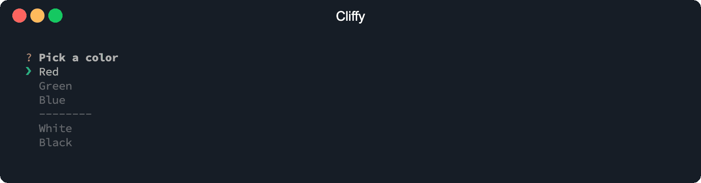

# Select

The `Select` prompt lets you select a option from an options list.



```typescript
import { Select } from "@cliffy/prompt/select";

const color = await Select.prompt({
  message: "Pick a color",
  options: [
    { name: "Red", value: "#ff0000" },
    { name: "Green", value: "#00ff00", disabled: true },
    { name: "Blue", value: "#0000ff" },
    Select.separator("--------"),
    { name: "White", value: "#ffffff" },
    { name: "Black", value: "#000000" },
  ],
});
```

```console
$ deno run examples/prompt/select.ts
```

## Options

The `Select` prompt has all [base options](./index.md) and the following prompt
specific options.

### Select options

With the `options` option you specify an array of options. An option can be
either a string or an options object. Options can be also nested, see
[child options](#child-options).

#### Select option

##### Option value

Value which will be returned as result.

##### Option name

Name is displayed in the list. Defaults to `value`.

##### Disable option

Disabled item. Can't be selected.

### Max rows

The `maxRows` option specifies the number of options displayed per page.
Defaults to `10`.

### List pointer

With the `listPointer` you specify the list pointer icon. Default is `❯`.

### Enable search input

You can enable a search/filter input with the `search` option. The `search`
option is useful if you have a large list of options.

You can change the search input label with the `searchLabel` option.

### Display usage info

The `info` option enables the info bar which displays some usage information.

### Child options

The `options` option allows you to group options together. It accepts an array
of child options, of which you can nest as many as you want.

```ts
import { Select } from "@cliffy/prompt/select";

const title = await Select.prompt({
  message: "Pick a book",
  search: true,
  options: [
    {
      name: "Harry Potter",
      options: [
        "Harry Potter and the Philosopher's Stone",
        "Harry Potter and the Chamber of Secrets",
        "Harry Potter and the Prisoner of Azkaban",
        "Harry Potter and the Goblet of Fire",
        "Harry Potter and the Order of the Phoenix",
        "Harry Potter and the Half-Blood Prince",
        "Harry Potter and the Deathly Hallows",
      ],
    },
    {
      name: "Middle-Earth",
      options: [
        "The Hobbit",
        {
          name: "The Lord of the Rings",
          options: [
            "The Fellowship of the Ring",
            "The Two Towers",
            "The Return of the King",
          ],
        },
        "Silmarillion",
      ],
    },
  ],
});

console.log({ title });
```

#### Max breadcrumb items

The `maxBreadcrumbItems` option limits the maximum number of breadcrumb items
which will be displayed.

#### Breadcrumb separator

with the `breadcrumbSeparator` option the breadcrumb separator can be changed.

#### Back pointer

With the `backPointer` option you can change the icon of the _back_ option to
any string value.

#### Group pointer

With the `groupPointer` option you can change the pointer of _group_ options to
any string value.

#### Group icon

With the `groupIcon` option you can change the icon of _group_ options to any
string value.

#### Group open icon

With the `groupOpenIcon` option you can change the icon of _opened group_
options to any string value.
