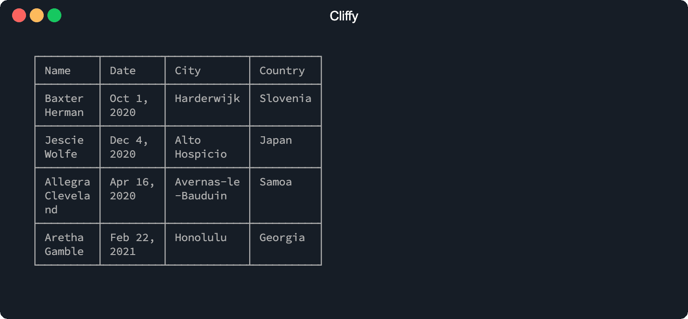

# Table options

To customize the table, the table class provides a few chainable option methods.
To see a list of all available options go to the [Table](#table) API section.

```ts
import { Table } from "@cliffy/table";

new Table()
  .header(["Name", "Date", "City", "Country"])
  .body([
    ["Baxter Herman", "Oct 1, 2020", "Harderwijk", "Slovenia"],
    ["Jescie Wolfe", "Dec 4, 2020", "Alto Hospicio", "Japan"],
    ["Allegra Cleveland", "Apr 16, 2020", "Avernas-le-Bauduin", "Samoa"],
    ["Aretha Gamble", "Feb 22, 2021", "Honolulu", "Georgia"],
  ])
  .maxColWidth(10)
  .padding(1)
  .indent(2)
  .border()
  .render();
```

```console
$ deno run examples/table/table_options.ts
```



## Header and Body

To define a table header you can use the `.header()` method. The header is not
affected by any `Array` method like `.sort()` because it is stored as a separate
property and not in the array stack. The `.body()` method adds an array of rows
to the table and removes all existing rows.

The first argument of the `.header()` method can be an `Array` of `string`
and/or `Cell`.

The first argument of the `.body()` can be an `Array` of rows and a row can be
an `Array` of `string` and `Cell`. You can read more about rows and cells
[here](./rows_and_cells.md).

```ts
import { Table } from "@cliffy/table";

new Table()
  .header(["Name", "Date", "City", "Country"])
  .body([
    ["Baxter Herman", "Oct 1, 2020", "Harderwijk", "Slovenia"],
    ["Jescie Wolfe", "Dec 4, 2020", "Alto Hospicio", "Japan"],
    ["Allegra Cleveland", "Apr 16, 2020", "Avernas-le-Bauduin", "Samoa"],
    ["Aretha Gamble", "Feb 22, 2021", "Honolulu", "Georgia"],
  ])
  .render();
```

```console
$ deno run examples/table/header_and_body.ts
```


## Columns

The `.columns(columns)` method can be used to set column options of multiple
columns. All available column options can be found [here](./columns.md).

```ts
import { Column, Table } from "@cliffy/table";

new Table()
  .body([
    ["Baxter Herman", "Oct 1, 2020", "Harderwijk", "Slovenia"],
    ["Jescie Wolfe", "Dec 4, 2020", "Alto Hospicio", "Japan"],
    ["Allegra Cleveland", "Apr 16, 2020", "Avernas-le-Bauduin", "Samoa"],
    ["Aretha Gamble", "Feb 22, 2021", "Honolulu", "Georgia"],
  ])
  .columns([
    { border: true },
    new Column().align("right"),
  ])
  .render();
```

## Column

With the `.column(index, options)` method you can set options for a single
column at a specific index. All available column options can be found
[here](./columns.md).

```ts
import { Column, Table } from "@cliffy/table";

new Table()
  .body([
    ["Baxter Herman", "Oct 1, 2020", "Harderwijk", "Slovenia"],
    ["Jescie Wolfe", "Dec 4, 2020", "Alto Hospicio", "Japan"],
    ["Allegra Cleveland", "Apr 16, 2020", "Avernas-le-Bauduin", "Samoa"],
    ["Aretha Gamble", "Feb 22, 2021", "Honolulu", "Georgia"],
  ])
  .column(0, {
    border: true,
  })
  .column(1, new Column().align("right"))
  .render();
```

## Render

The `.render()` method outputs the table to stdout. If you need the output as
string you can use the `.toString()` method return the table as string.

## Column width

You can set the min/max width of columns with the `.minColWidth()` and
`.maxColWidth()` methods.

## Max width

The `.maxWidth(width)` method sets the maximum total width of the table in
columns. This is required for `flexGrow`, `flexShrink`, and `flex` to work.
Without a finite max width the layout has no target and flex is a no-op.

```ts
import { Table } from "@cliffy/table";

new Table()
  .body([["foo", "bar"]])
  .maxWidth(80)
  .flexShrink([0, 1])
  .render();
```

## Responsive flex

The `.flexGrow()`, `.flexShrink()`, and `.flex()` table-level methods set a
default flex weight for all columns. They accept either a single number (applied
to every column) or an array of per-column weights.

> [!NOTE]
> A finite `.maxWidth()` must be set on the table for flex to have any effect.

```ts
import { Table } from "@cliffy/table";

// Grow the second column to fill available space, keep others rigid.
new Table()
  .body([["Name", "Description", "Version"]])
  .maxWidth(100)
  .flexGrow([0, 1, 0])
  .render();

// Shrink only the second column on overflow.
new Table()
  .body([["Name", "Description", "Version"]])
  .maxWidth(60)
  .flexShrink([0, 1, 0])
  .render();

// Shorthand: grow and shrink together.
new Table()
  .body([["Name", "Description", "Version"]])
  .maxWidth(80)
  .flex([0, 1, 0])
  .render();
```

For per-column control use the `Column` class — see
[Flex grow](./columns.md#flex-grow), [Flex shrink](./columns.md#flex-shrink),
and [Flex (shorthand)](./columns.md#flex-shorthand) in the column docs.

## Cell padding

The `.padding()` method adds padding to all cell.

## Border

You can enable border by using the `.border()` method.

### Border style

With the `.chars()` method you can change the border style.

Here is an example of the default border characters:

```json
{
  "top": "─",
  "topMid": "┬",
  "topLeft": "┌",
  "topRight": "┐",
  "bottom": "─",
  "bottomMid": "┴",
  "bottomLeft": "└",
  "bottomRight": "┘",
  "left": "│",
  "leftMid": "├",
  "mid": "─",
  "midMid": "┼",
  "right": "│",
  "rightMid": "┤",
  "middle": "│"
}
```

## Align content

The content can be aligned with the `.align()` method. The first argument is the
direction. Possible values are:

- `"left"`
- `"right"`
- `"center"`

## Table indent

With the `.indent()` method you can add indentation to the table.

## Clone

The `.clone()` method clones the entire table.
