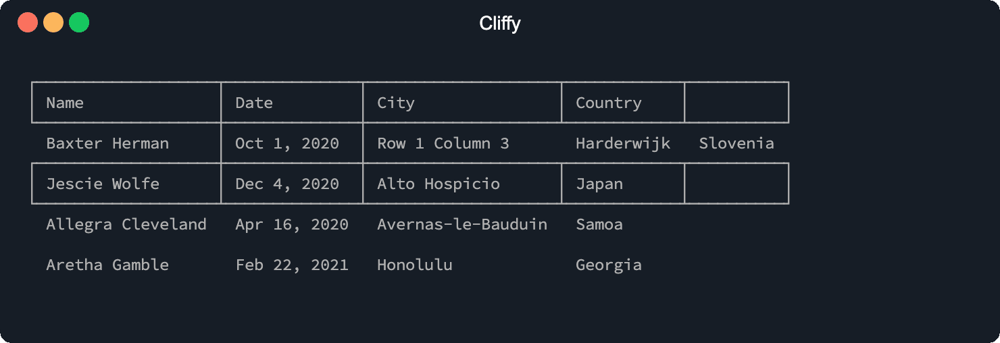
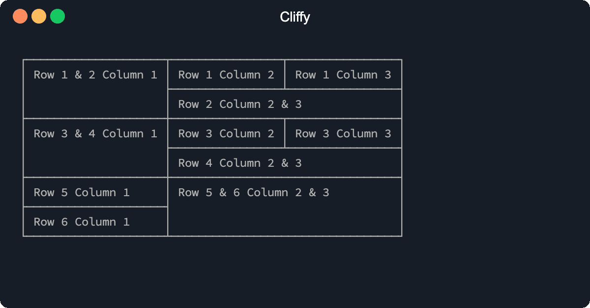

# Rows and cells

It is also possible to customize single rows and cell. To do this you can use
the `Row` and `Cell` class. The `Row` class is also an `Array` class like the
`Table` class.

```ts
import { Cell, Row, Table } from "@cliffy/table";

new Table()
  .header(Row.from(["Name", "Date", "City", "Country"]).border())
  .body([
    [
      "Baxter Herman",
      new Cell("Oct 1, 2020").border(),
      "Row 1 Column 3",
      "Harderwijk",
      "Slovenia",
    ],
    new Row("Jescie Wolfe", "Dec 4, 2020", "Alto Hospicio", "Japan").border(
      true,
    ),
    ["Allegra Cleveland", "Apr 16, 2020", "Avernas-le-Bauduin", "Samoa"],
    ["Aretha Gamble", "Feb 22, 2021", "Honolulu", "Georgia"],
  ])
  .render();
```

```console
$ deno run examples/table/rows_and_cells.ts
```



## Rows

### Row border

To enable row border you can use the `.border()` method.

### Align row content

The `.align()` method aligns the content of all cells in the row. The first
argument is the direction. Possible values are:

- `"left"`
- `"right"`
- `"center"`

### Clone row

The `.clone()` method clones the entire row.

## Cells

### Cell border

With the `.border()` method you can add border to a cell.

### Align cell content

The `.align()` method aligns the content of the cell. The first argument is the
direction. Possible values are:

- `"left"`
- `"right"`
- `"center"`

### Colspan and rowspan

`.colSpan()` and `.rowSpan()` allows a single table cell to span the
width/height of more than one column and/or row. With `.colSpan()` and
`.rowSpan()` the next or lower cell is moved to the right if the next or lower
cell is not of type `undefined`. If it's of type `undefined` the cell is
overriden.

The following examples both have the same output.

**Override undefined values**

```ts
import { Cell, Table } from "@cliffy/table";

Table.from([
  [
    new Cell("Row 1 & 2 Column 1").rowSpan(2),
    "Row 1 Column 2",
    "Row 1 Column 3",
  ],
  [undefined, new Cell("Row 2 Column 2 & 3").colSpan(2), undefined],
  [
    new Cell("Row 3 & 4 Column 1").rowSpan(2),
    "Row 3 Column 2",
    "Row 3 Column 3",
  ],
  [undefined, new Cell("Row 4 Column 2 & 3").colSpan(2), undefined],
  [
    "Row 5 Column 1",
    new Cell("Row 5 & 6 Column 2 & 3").rowSpan(2).colSpan(2),
    undefined,
  ],
  ["Row 6 Column 1", undefined, undefined],
])
  .border()
  .render();
```

**Omit undefined values**

```ts
import { Cell, Table } from "@cliffy/table";

Table.from([
  [
    new Cell("Row 1 & 2 Column 1").rowSpan(2),
    "Row 1 Column 2",
    "Row 1 Column 3",
  ],
  [new Cell("Row 2 Column 2 & 3").colSpan(2)],
  [
    new Cell("Row 3 & 4 Column 1").rowSpan(2),
    "Row 3 Column 2",
    "Row 3 Column 3",
  ],
  [new Cell("Row 4 Column 2 & 3").colSpan(2)],
  ["Row 5 Column 1", new Cell("Row 5 & 6 Column 2 & 3").rowSpan(2).colSpan(2)],
  ["Row 6 Column 1"],
])
  .border()
  .render();
```

```console
$ deno run examples/table/colspan_and_rowspan.ts
```



### Clone cell

To clone a single cell you can use the `.clone()` method.
